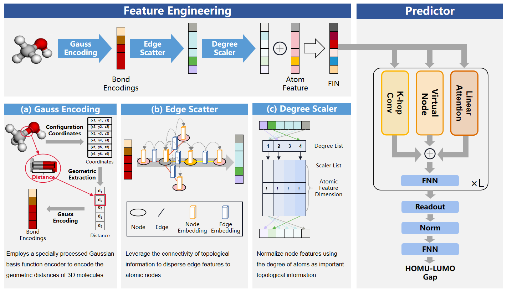

<h1 style="border-bottom: 2px solid lightgray;">TGF-M: Topology-Augmented Geometric Features Enhance Molecular Property Prediction</h1>

__Abstract:__ Accurate prediction of molecular properties is a key component of Artificial Intelligence-driven Drug Design (AIDD). Despite significant progress in improving these predictive models, balancing accuracy with computational complexity remains a challenge. 
Molecular topological and geometric features provide rich spatial information, crucial for improving prediction accuracy, but their extraction typically increases model complexity. To address this, we propose TGF-M (Topology-augmented Geometric Features for Molecular Property Prediction), a novel predictive model that optimizes feature extraction to enhance information capture and improve model accuracy, and reduces model complexity to lower computational cost. This approach enhances the model’s ability to leverage both topological and geometric features without unnecessary complexity.  On the re-segmented PCQM4Mv2 dataset, TGF-M performs remarkably, achieving a low mean absolute error (MAE) of 0.0647 in the HOMO-LUMO gap prediction task with only 6.4M parameters. Compared to two recent state-of-the-art models evaluated within a unified validation framework, TGF-M demonstrates comparable performance with less than one-tenth of the parameters. We conducted an in-depth analysis of TGF-M's chemical interpretability. The results further validate the method’s effectiveness in leveraging complex molecular topology and geometry during model learning, underscoring its potential and advantages.  



## Getting Started

### Installation

Set up conda environment and clone the github repo

```
cd ./TGF-M
conda env create -f requirement.yaml
conda activate TGF-M
pip install torch==1.7.1+cu110 torchvision==0.8.2+cu110 torchaudio==0.7.2 -f https://download.pytorch.org/whl/torch_stable.html
pip install torch_geometric==1.6.3
pip install torch_scatter==2.0.7
pip install torch_sparse==0.6.9
pip install azureml-defaults
pip install rdkit-pypi cython
python setup.py build_ext --inplace
python setup_cython.py build_ext --inplace
pip install -e .
pip install --upgrade protobuf==3.20.1
pip install --upgrade tensorboard==2.9.1
pip install --upgrade tensorboardX==2.5.1
```

### Dataset

You can download the pre-training data and benchmarks used in the paper [here](https://drive.google.com/file/d/1aDtN6Qqddwwn2x612kWz9g0xQcuAtzDE/view?usp=sharing) and extract the zip file under `./data` folder. The data for pre-training can be found in `pubchem-10m-clean.txt`. All the databases for fine-tuning are saved in the folder under the benchmark name. You can also find the benchmarks from [MoleculeNet](https://moleculenet.org/).

### Data preprocessing
To convert SMILES strings into molecular graphs using RDKit, refer to the data processing code available in `dataset/dataset.py`.

RDKit link[https://github.com/rdkit/rdkit]

### Pre-training

To train the DIG-Mol, where the configurations and detailed explaination for each variable can be found in `config.yaml`
```
$ python train.py
```

### Fine-tuning 

To fine-tune the DIG-Mol pre-trained model on downstream molecular benchmarks, where the configurations and detailed explaination for each variable can be found in `config_finetune.yaml`
```
$ python train.py
```

### Pre-trained models

We also provide pre-trained DIGNN models, which can be found in `model.pth` and `model_50.pth` for different pretraining epoches respectively. 

